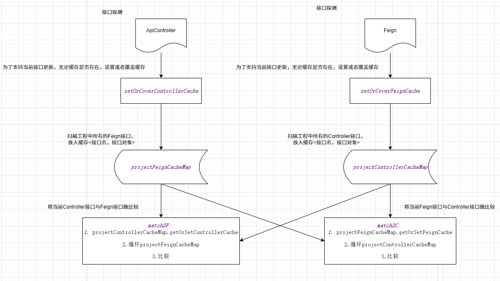

# WAAAGH!!! — Update Log

Every line of this project (code + tests) is generated end to end by large language
models; humans only provide ideas and final acceptance. Version history starts fresh
under the WAAAGH!!! name.

### 🚀 WAAAGH!!! v1.0.0 — Feign ↔ Controller Navigator

- Bidirectional gutter-icon navigation between Spring Cloud `@FeignClient` methods and
  matching `@RestController` / `@Controller` endpoints.
- **Go to Implementation** (`Ctrl+Alt+B`) and **Go to Declaration** (`Ctrl+B` / Ctrl+Click)
  across modules.
- **Call Hierarchy** integration: Feign methods appear as Controller callers; Controllers
  appear as Feign callees.
- Parses `server.servlet.context-path` and `spring.mvc.servlet.path` from
  `application` / `bootstrap` `.properties` / `.yml` / `.yaml` files.
- Resolves Restful path values written as literals or as static constants.
- Bilateral PSI cache and full-URL clipboard copy.

Bilateral cache architecture:

